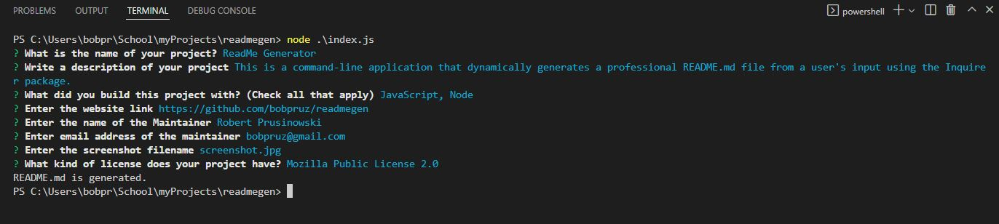

# ReadMe Generator
  
  ## License

  

  ## Description

  This is a command-line application that dynamically generates a professional README.md file from a user's input using the Inquirer package.

  ## Built With

  JavaScript, Node

  ## Website

  https://github.com/bobpruz/readmegen

  ## Maintainer

  <a href="mailto:bobpruz@gmail.com">Email: Robert Prusinowski</a>
  
  ## Video Link
  
  <a href="https://drive.google.com/file/d/1BHApkk8fclXdvumSy_b5UOzvtgMUsSE9/view?usp=sharing">Link to Video</a>

  ## Screenshot

  

  
